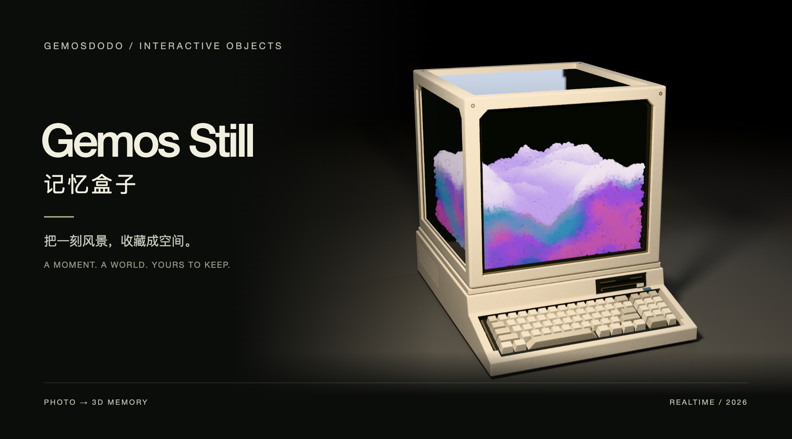

<p align="center"><a href="README.md">English</a> · <strong>简体中文</strong></p>



# Gemos Still 记忆盒子

**把一刻风景，收藏在一个小小的世界里。**

由 **Gemosdodo** 制作的浏览器记忆终端：将照片重建为高斯 3D 场景，放进复古电脑的玻璃仓，再把收藏过程制作成影片。

[在线体验](https://gemosdodo.art/vibecoding-projects/still-memory-box/index.html) · [作者网站](https://gemosdodo.art) · [English](README.md)

## 功能

- 待机时，彩色粒子在玻璃仓内形成有体积的潮汐。
- 个性化照片卡插入软驱，湍流粒子从下往上构筑场景。
- 立方玻璃仓、精细键盘、烘焙漫反射光照与细微 ABS 塑料颗粒。
- 单指旋转、双指缩放、平滑复位，以及构图与空间层次调整。
- 浏览器本机生成、保存，以及 `.still` 记忆文件导入导出。
- 52 秒展示影片：收藏构筑、微距绕拍、九宫格动态作品墙、程序合成配乐和品牌片尾。
- 横屏与竖屏 MP4，支持 **1080P30、1080P60、4K30、4K60** 逐帧导出。

## 本地运行

```sh
git clone https://github.com/duoduoaiduoduo/gemos-still.git
cd gemos-still
python3 -m http.server 8765 --bind 127.0.0.1
```

打开 **http://127.0.0.1:8765**。不需要构建步骤，也不需要 Python 推理服务。请不要直接以 `file://` 打开网页。

可以先查看内置示例，或打开已有记忆文件。点击「新建记忆」选择照片；完成后，在「调整」面板中保存、重播收藏过程或「制作展示影片」。目前产品界面为中文，项目说明提供中英双语。

## 设备要求与实际边界

| 操作 | 要求 |
| --- | --- |
| 查看模型和已有记忆 | 支持 WebGL 2 的浏览器，可触控操作 |
| 电脑从照片生成 | 原有 FP16 WebGPU 模型、`shader-f16`、足够的显存 |
| 手机生成（实验） | 自动下载轻量模型；CPU WebAssembly 和足够内存 |
| 导出影片 | 支持 H.264 编码的 WebCodecs；配乐需要 AAC |
| 对外部署 | HTTPS 静态托管 |

电脑首次生成需从 Hugging Face 下载约 **1.31 GB** 社区转换的 SHARP 模型；支持时通过 OPFS 缓存。手机有芯片不代表浏览器已开放相应能力，也不代表内存足够。手机改用独立的 256 INT8 CPU/WASM 路径，自动从本站下载 [APK 同款轻量模型](https://github.com/duoduoaiduoduo/gemos-still/releases/tag/android-v0.4.0-lite)（约 809 MB），显示下载进度，本机校验并缓存；已有模型包也可手动导入。电脑端保持原样，没有服务器推理。手机浏览器仍可能受内存限制，失败时可用 APK 生成后导入 `.still`。能看示例不等于能运行推理。

单张照片无法还原没有拍到的表面，大角度观察可能出现空洞、拉伸或缺失。主体构图使用几何与对比度启发式分析，不是语义识别。玻璃属于实时近似渲染，不是全场景路径追踪。

4K60 使用真正的 3840 × 2160 渲染目标（竖屏为 2160 × 3840），完整影片包含 3,120 帧；制作时间可能超过播放时长，并消耗较多内存。不支持的编码器会提示错误，不会偷偷降低画质。九宫格素材是预渲染的 2304 方形图集，4K 导出不代表每个小格也是原生 4K。

## 隐私与保存

照片与生成的记忆在访客设备内处理，并存储于当前网站的 IndexedDB，不上传至推理服务器。静态资源来自网站，模型下载会连接 Hugging Face，包含正常连接信息，但不包含用户照片。浏览器数据可能被清理或回收，请导出 `.still` 文件长期备份。视频同样在本机制作。

## 部署、开发与许可

- [部署与架构说明 / Deployment and architecture](docs/DEVELOPMENT.md)
- [第三方与素材说明 / Third-party notices](THIRD_PARTY_NOTICES.md)
- [应用源码 MIT 许可证](LICENSE)

独立编写的应用源码以 MIT 开源。**SHARP 模型仍受 Apple 研究模型许可证限制**，不能用本项目的 MIT 许可替代其条款。仓库不包含模型权重。品牌插画、照片和渲染演示素材不在源码 MIT 授权范围内，复用前请阅读素材说明。

## 致谢

作者：**Gemosdodo**。使用 Three.js、Apple SHARP（社区 ONNX 转换）、ONNX Runtime Web、Mediabunny 与 Blender Cycles。本项目独立制作，不代表上述项目或厂商背书。

模型下载现优先使用第三方 hf-mirror.net 镜像，失败切换 Hugging Face；两者仅接收模型请求，不接收照片。镜像可用性仍取决于网络。
